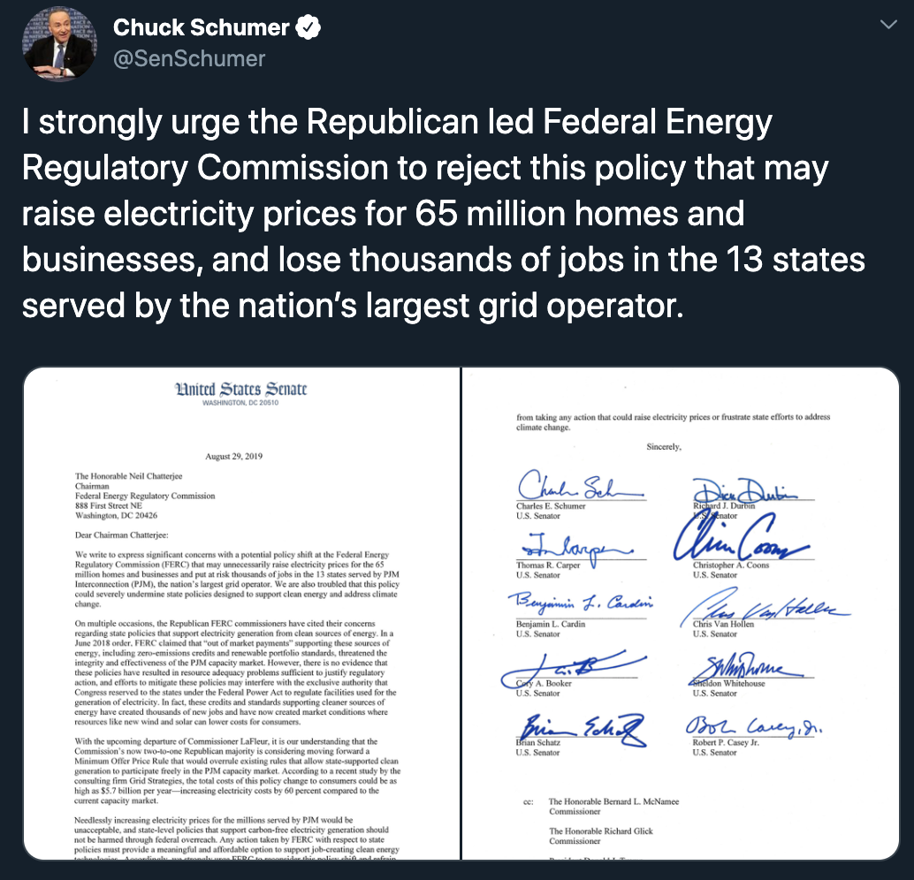
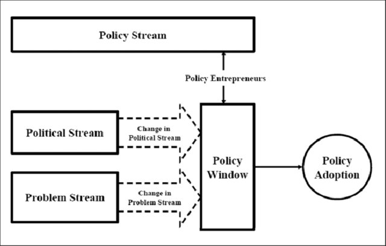

class: inverse center

The Policy Process

---

| Public Policy | Author |
|: --- |: --- |
|"the actions of government and the intentions that determine those actions" | Cochran et al. (2010) |
| "the outcome of the struggle in government of who gets what" | Cochran et al. (2010) citing Lasswell's (1936) definition of politics as the struggle over "who gets what, when, and how" |
| "whatever governments choose to do of not to do" | Dye (2013) |
| "political decisions for implementing programs to achieve societal goals" | Cochran and Malone (2010) |
| the sum of government activity, whether acting directly or through agents" | Peters (2010) | 
| "statements by government of what it intends to do...the lack of such statements may also be an *implicit* statement of policy" | Birkland (2020) |
| "texts, practices, and symbols, and discourses that define and deliver values" | Schneider and Ingram (1997) | 

---

## "Implicit" Policy - Rights  
Unlike some countries, the US Constitution and law does not explicitly guarantee rights such as healthcare, housing, a living wage. Such ommissions imply a policy of not guaranteeing such rights.

--

> In *Juliana, et al. v. United States*, plaintiffs argued that the federal government is violating their right to life and liberty.
While the ninth circuit panel found the government is violating the plaintiffs' constitutional rights, two of the three judges said that the requested remedies should be addressed by the executive and legislative branches.

--

The *Public Trust Doctrine* and other *common law* doctrines are rooted in rights claims.

(More on rights as policy and the role of rights claims in policymaking in Stone, Chapter 15) 

---

## "Implicit" Policy - Practices  
- "street-level bureaucrats" such as teachers, election officials, police officers (Lipsky 2010) 

---

## "Explicit" policy

--

- Constitution
- Statute  
- Rule  
- Court precedent  
- Executive order
- Budget
- etc.

---

## The Policy Process 

problem definition -> agenda setting -> policy making -> implimentation

(or something like this)
---

## Policy analysis vs. policy studies

> *Policy analysis* tends to concentrate on the formal evaluation or estimation of "policy impacts" or outcomes, usually by using quantitative techniques such as cost-benefit analysis (CBA) or risk assessment and managment...*Policy studies*, on the other hand, are broader in scope, examining not just individual programs and their effects, but also their causes and presuppositions, and the processes that led to their adoption. (Howlett, Ramesh, and Pearl, 2009)

- *Policy analysis* is what we do when writing a policy memo (see Weimer and Vining 2017 and Bardach and Patashnik 2016)  
- *Policy studies* is what we do in class 

---

## Democracy and technocracy

Machiavelli's *The Prince* 

Enlightenment social philosophies based on reason (Hobbes, Locke, Rousseau, Montesquieu)

**Technocracy** A system of government characterized by high reliance on a small elite of technical experts, whose decisions about public policy are more influential than the desires of citizens. 

---

## Classical liberalism 

> The ideological system that emphasizes individual liberty and the ownership and acquisition of private property as a means to improve society's wealth and discourage social strife. 

See John Locke's *Second Treatise of Civil Government* (1690) 

Influential among the framers, especially anti-federalists (see the 5th Amendment). 

---

## The Public Interest

> The *assumed* broader desires or needs of the public, in whose name policy is made. The public interest is hard to define but is something to which all policy advocates appeal.

---

## Politics 

- the process by which a society determines who gets, what, when, and how (critiqued as implying zero-sum)  

- the art or science of government 

- collective action (politics and policy as a means to net benefits)  

- participation in civic life (Dewey and Rogers 2016, Stone 2012)

- "playing politics" and "political hobbyism" [(Hersh 2020)](https://www.theatlantic.com/ideas/archive/2020/01/political-hobbyists-are-ruining-politics/605212/)

---

## Problem

> A usually undesirable situation that, some assert, can be alleviated by government action.

---

## Evidence

> Listen: [Moonshots-Thomas Kalil](https://scholars.org/podcast/moonshots)

> Listen: [Informing Policy-Jenni W. Owen](https://scholars.org/podcast/informing-policy)

Where policy priorities come from: 
- Policymakers  
- Crises - "focusing events" (e.g. Ebola)
- Advisory committees 
- Institutions designed to inform policy like the Congressional Budget Office (CBO), Congressional Research Service (CRS), and Government Accountability Office (GAO) and research arms of executive agencies (DARPA, ARS, CEQ, etc.).

---

## Bureaucracy 

If you care about implementation, you need support from the bottom as well as the top  
- "we bes" can "slow roll" or "fast track" (Potter 2017)

---

background-image: url(figs/water-war.jpg)
background-size: contain

---

class: inverse center

The Policy Environment

---

background-image: url(figs/stages.jpg)
background-size: contain

---

## The Structural Environment 

- Separation of Powers

- Federalism

- *Substantive policies*: A policy that explains how the government will go about its policy goals in a particular area.

- *Procedural policies* (e.g., Administrative Procedures Act)

- *Transparency requirements* (Open public meetings laws, Freedom of Information Act)

---

## The Socio-economic Environment 

Demographics (population age, gender, race, class, etc.)

???

As I said, I chose this book because it is an excellent overview of the field. It is not a critical perspective of the filed. 
You may have noticed that he sometimes says "we" and "people" and "Americans" and "our national experience" when he means "White Americans" and "those people" and "their cultures" when he refers to people who are not White. 

Surely I am part of this as well. I know often say things like "the kind of people who are on the supreme court" rather than "old white men born to wealthy families that got them into prestigious law schools"--this probably obscures what is going on. Still, honestly, that is a mouthful, and I trust you to know what I mean. 

---

## The Political Environment

"Most important issue" polls

Forced choice:

---

### Issue opinion polls

---

---

## Input-Output Model of Policymaking

---

## Inputs to legislative-branch policymaking

- Casework (constituents)  
- Experts, including CBO, GAO, CRS, and advisory panels
- Interest group pressure campaigns (constituents and non-constituents)  
- Media (often informed by experts or pressure campaigns)
- The threat of presidential veto or pocket veto
- The threat of judicial review

---

### Government officials as "processors of inputs"

Also see ["Do Politicians Racially Discriminate Against Constituents?"](https://www.jstor.org/stable/23024931?seq=15#metadata_info_tab_contents)

<!--

--

--

--

-->

---

Acting on inputs: Roll Call Votes in Congress

---

Acting on inputs: Roll Call Votes in Congress

---

Acting on inputs: Congressional Oversight of Agencies

---

## Inputs to executive-branch policymaking

Congressional oversight
- Statutory deadlines, reporting requirements, or budget restrictions, the threat of repeal under the Congressional Review Act
- CRS, CBO, GAO
- [Hearings](Clinton Lewis Selin 2014) and [Direct correspondence with legislators](https://judgelord.github.io/correspondence/APSA2018/APSA2018pres.pdf)  

Public comments on proposed agency rules (e.g., regulations.gov) 
  - Experts 
  - [Public pressure campaigns](https://judgelord.github.io/dissertation/present/whyMail-APW.html#1) and [other interest group lobbying coalitions](https://www.niskanencenter.org/how-bureaucrats-make-good-policy/)
  
Whitehouse oversight over the *career civil service*
- Appoint and remove agency heads
- OMB/OIRA Review  

Judicial Oversight
- Citizen suits and court-imposed deadlines
  
---

background-image: url(figs/hearing-internet.jpg)
size: contain
class: inverse

### A subcommittee hearing on C-SPAN

---

background-image: url(figs/hearings-jana.png)
size: contain

---

## Inputs to judicial-branch policymaking

In selecting cases ("granting *cert.*")
- *Original jurisdiction*
- *Circuit splits* (where a court has *appellate jurisdiction*)
- *Test cases*, where [*“legal entrepreneurs”*](https://www.wnycstudios.org/podcasts/radiolabmoreperfect/episodes/architect-edward-blum) recruit sympathetic plaintiffs to change precedent

In each case 
- briefs (plaintiff, respondent, Solicitor General, amicus)
- arguments (plaintiff, respondent and their designees)

The legal profession
- Law Review articles 

Public opinion

---

## Outputs

**statute laws**: Laws made by the legislature and signed by the executive, generally codified into *The U.S. Code (e.g., Title 5 U.S. Code § 706)* or state codes. 

**administrative rules**: Often called regulations, but also include funding criteria, deregulatory policy, and many other kinds of policy. They usually have the force of law, are published in the *Federal Register (FR)*, and are codified in the *Code of Federal Regulations (CFR)* or state registers and codes (unlike informal *guidance*).

**case law**: ~~Laws that are made~~ *Interpretations of laws* as a result of judicial decisions that influence future decisions, called *legal precedent.*

---

### Legislative outputs (p. 117)

- Bills (including authorizations and appropriations)
- Joint resolutions
- Concurrent resolutions

See The University of Washington's [Legislative Explorer](http://www.legex.org/us/process/)

See [More Effective Than We Thought: Accounting for Legislative Hitchhikers Reveals a More Inclusive and Productive Lawmaking Process](https://onlinelibrary.wiley.com/doi/full/10.1111/ajps.12472)

---

class: inverse center

# Actors

---

## Official Actors 

- Elected officials 
- Staff (Congressional, white house, county executive's policy advisor, etc.) 
  - See [Legislative Staff and Representation in Congress](https://www.cambridge.org/core/journals/american-political-science-review/article/legislative-staff-and-representation-in-congress/D7735FCF39B843B9F3269FD39362FD66)
- Political appointees
- Career civil service (General Schedule (GS), Senior Executive Service)
  - See [Buzzfeed's leaked personal records](https://www.buzzfeednews.com/article/jsvine/sharing-hundreds-of-millions-of-federal-payroll-records)
- Judges (supreme court, circuit court, administrative law)
  - Clerks
- Contractors? 

---

background-image: url(figs/staffers.jpeg)
background-size: contain

---

## Unofficial Actors

---

background-image: url(figs/turnout-age.png)
size: contain

### Citizens

---

The ward anchored by Sellery Residence Hall on the southeast side of the campus saw 330 voters compared to 128 in 2014, and three times as many voters showed up in Ward 59, which serves the campus’ Lakeshore neighborhood. In Ward 54, which serves the Newell Smith Residence Hall, 136 voters showed up Tuesday compared to 39 in 2014.

[Voter information](https://www.wisconsinvote.org/candidates-and-races)

???

### Constituents

- Casework (Fiorina 1981, Johannas and McAdams 1981, Lowande 2019)
- Policy opinions (DeCrescenso)

---

### Social movements

See Theda Skocpol and Vanessa Williams on the [sucess of the tea party movement](https://scholar.harvard.edu/files/williamson/files/tea_party_pop_0.pdf) and Theda Skocpol on the [failure of the climate movement](https://scholars.org/sites/scholars/files/skocpol_captrade_report_january_2013_0.pdf)

???

Matto Mildenberger on the 

---

### The press 

> “A popular Government, without popular information, or the means of acquiring it, is but a Prologue to a Farce or a Tragedy; or, perhaps both...And a people who mean to be their own Governors, must arm themselves with the power which knowledge gives.” - James Madison (1822)

For example, [local papers uncovered problems with water in Flint, MI.](https://www.journalism.org/essay/searching-for-news/)

---

---

background-image: url(figs/oversight-budgets.png)
background-size: contain

---

<iframe src="https://www.journalism.org/chart/sotnm-newspapers-newsroom-employment/iframe/" id="pew62613" scrolling="no" width="100%" height="500px" frameborder="0"></iframe>             

---

When newspapers close, voters have less information.

- [Turnout decreases by ~8%](https://journals.sagepub.com/doi/10.1177/1078087409351947), [(one additional paper increases turnout by ~.3%, and, among readers, incrases turnout by 13%)](http://web.stanford.edu/~gentzkow/research/voting.pdf)
- [Split ticket decreases by ~2%](https://academic.oup.com/joc/article/68/6/1007/5160090)
- [Civic participation decreases](https://www.tandfonline.com/doi/full/10.1080/10584609.2012.762817)

[Fewer local reporters](https://www.pewresearch.org/topics/newspapers/) lead to [fewer candidates and less competitive elections](https://journals.sagepub.com/doi/full/10.1177/1078087419838058?casa_token=M3-Rd_xUuhgAAAAA%3AMouibGXaJDk1CUpD5rdSeWUAjjtAlEl2OtqM0cV-_nFZz02CgYanxv71WAJOcZKvKJaGWTaCv1Ys&), and a [shift in focus from policy and institutions to "city life"](https://www.niemanlab.org/2019/11/damaged-newspapers-damaged-civic-life-how-the-gutting-of-local-newsrooms-has-led-to-a-less-informed-public/)

Voters in districts with less campaign coverage were less able to evaluate their House incumbent and not as capable of identifying the candidates vying for office as liberal or conservative. They were also less likely to report that they planned to vote in the House election. [(Lawless and Hayes)](https://www.brookings.edu/blog/fixgov/2015/02/03/the-troubling-causes-and-consequences-of-diminished-local-news/)

<!--Torres?-->

---

## Interest groups 

- [Public interest groups](https://judgelord.github.io/dissertation/present/whyMail-APW.html#19)
- Economic/private interest groups (e.g., industry associations)
- Membership associations (e.g., professional associations)

---

## Lobbying via campaign donations

---

---

Estimated Effect of Energy-Sector PAC Donations on Legislator Advocacy

---

# Agenda Setting

**Agenda setting:** The process by which problems and alternative solutions gain or lose public and elite attention (including the activities or actors to prevent problems or solutions from gaining attention)

---

**Enactment:** The act of putting a decision, such as legislation or regulation, into effect. Statues are generally enacted in the United States when the President or governor signs a bill or when a legislature overrides their veto. Agency rules are enacted when published as "final rules" (vs. draft rules). 

---

The structure of policymaking institutions and advocacy organizations shapes agenda setting because *all* organizations systematically privilege some issues/ideas/conflicts/solutions over others.  

> "All forms of political organization have a bias in favor of the exploitation of some kinds of conflict and the suppression of others because *organization is the mobilization of bias*. Some issues are organized into politics, while others are organized out." - E. E. Schattshneider

---

Fully comprehensive and "rational" agenda-setting is unrealistic. 

**Garbage can model:** A model of decision-making developed by Cohen, March, and Olsen, who argue that organizations are "organized anarchies" and make decisions based on the flow of problems, solutions, and participants into the choice opportunities they call "garbage cans." This is the foundation of Kingdon's Multiple Streams metaphor. 

--

 

---

**Window of Opportunity:** The point in time at which policy change becomes more likely (from Kingdon's streams metaphor)

---

"Problem streams" and "political streams" may change rapidly due to a **focusing event:** A sudden event that can generate attention to public problems or issues, particularly issues and problems that are actually or potentially harmful. 

The resulting pattern of policymaking is often called **punctuated equilibrium**.

---

background-image: url(figs/carson.jpg)
background-size: contain

---

"The Origin of Ideas" by Jennifer Bookhart and Alex Tahk

---

---

background-image: url(figs/brookhart3.png)
background-size: contain

---

# Elite Theory v. Pluralism

**Group theories** of the relationship between political actors and policy outcomes.

**Pluralism:** Policy results from many groups competing and negotiating with each other in a relatively open political system.

**Elite theory:** Policy results from negotiations among a relatively closed network of elites--those with high social status (elite educational credentials, wealth, etc.).

 *Who Governs?* by Robert A. Dahl vs. *The Power Elite* by C. Wright Mills (building on Max Weber)
 
These theories may be stated normatively (policymaking ought to be pluralist) or positively (policymaking is pluralist). Empirically, pluralism focuses more on behavior, elite theory more on structure.
 
---
 
AP US GOV version: 

---

[Why Do Agencies (Sometimes) Get So Much Mail?](https://judgelord.github.io/dissertation/present/whyMail-APW.html#34) 

---

From [Trade's Progressive Opposition]() by Iain Osgood and Hyeon-Young Ro

---

**Advocacy coalition:** Groups that come together based on a shared set of beliefs about a particular issue or problem (read [more](https://paulcairney.wordpress.com/2013/10/30/policy-concepts-in-1000-words-the-advocacy-coalition-framework/))

Related terms: *advocacy network*, *issue network*, *policy subsystem*, *policy regime*

---

## Elite theory critiques

"Iron triangle"

"Capture"

"Policy monopoly" 

"Influence" 

> "The flaw in the pluralist heaven is that the heavenly chorus sings with a strong upper-class accent." - E. E. Schattschneider

---

[A Bias Towards Business? Assessing Interest Group Influence on the U.S. Bureaucracy](https://onlinelibrary.wiley.com/doi/full/10.1111/j.1468-2508.2006.00375.x) by Jason Webb Yackee and Susan Webb Yackee

---

Businesses that comment on proposed regulations see significant bumps in profits.

From [What’s at Stake in Rulemaking? Financial Market Evidence for Banks’ Influence on Administrative Agencies](https://libgober.files.wordpress.com/2018/09/libgober-and-carpenter-unblinded-what-at-stake-in-rulemaking.pdf) by Brian Libgober and Daniel Carpenter 

---

background-image: url(figs/bonica-lawers-income.png)
background-size: contain

From [Professional Networks, Early Fundraising, and Electoral Success](https://www.vox.com/polyarchy/2016/6/30/12068490/too-many-lawyers-politics) by Adam Bonica

---

From [Professional Networks, Early Fundraising, and Electoral Success](https://www.vox.com/polyarchy/2016/6/30/12068490/too-many-lawyers-politics) by Adam Bonica

---

[How Every Member Got to Congress](https://www.nytimes.com/interactive/2019/01/26/opinion/sunday/paths-to-congress.html) By Sahil Chinoy and Jessia Ma

[The Cash Ceiling](https://www.vox.com/policy-and-politics/2018/10/24/18009856/working-class-income-inequality-randy-bryce-alexandria-ocasio-cortez) by Nick Carnes 

---

The likelihood that a policy change will be made is correlated with the preferences of high-income individuals (controlling for the preferences of low-income individuals), but the reverse is not true. 

From [Affluence & Influence: Economic Inequality and Political Power in America](https://themonkeycage.org/2012/08/economic-inequality-and-political-power-part-1/) by Martin Gilens

---

background-image: url(figs/broockman-skovron.png)
background-size: contain 

From "Bias in  
Perceptions of  
Public Opinion  
among Political  
Elites" by  
David Brookman  
and  
Chris Skovron  
[Article here](https://web.stanford.edu/~dbroock/published%20paper%20PDFs/broockman_skovron_bias_in_perception_of_public_opinion_among_political_elites.pdf) 

---

[Can Learning Constituency Opinion Affect How Legislators Vote?](https://www.dropbox.com/s/lpq9og464z3kkzx/QJPS_Inform.pdf?dl=0) by David Butler and David Nickerson

A randomly-assigned half of New Mexico state legislators were given the results of a survey of their constituents' opinions on a proposed tax rebate bill.

[more research like this](https://www.danielmarkbutler.com/research.html)

---

# Policy Tools and Typologies

---

# Wilson's Cost-Benefit Policy Typology

Describes the kind of politics generated by different policy tools, pg. 267. (Building on Lowi's Policy Typology, pg. 260-264.)

|                    | **Concentrated benefits**   | **Distributed Benefits**   |
|--------------------|-------------------------|------------------------|
| **Concentrated costs** | Interest group politics | Entrepeneurial politis |
| **Distributed costs**  | Clintele politics       | Majoritarian politics  |

<!---

???

venue shopping 

APD

https://www.martyduren.com/2016/03/04/a-brief-history-on-american-political-parties/

# 3 Context 

## Federalism 

**devolution** The process by which federal authorities, usually in the form of federally designed and administered programs, are delegated, in part, to state governments to manage. 

## Institutional constraints and stability

### Class 

Farmer-Labor 
CIO
Progressive movement 
The New Deal
Decline in unions

### Race

Incorporation doctrine 

Plessy 
Brown (p 99)
Nixon v. Herndon, Nixon v Condon, etc. 102

faces of power (p218)
-->