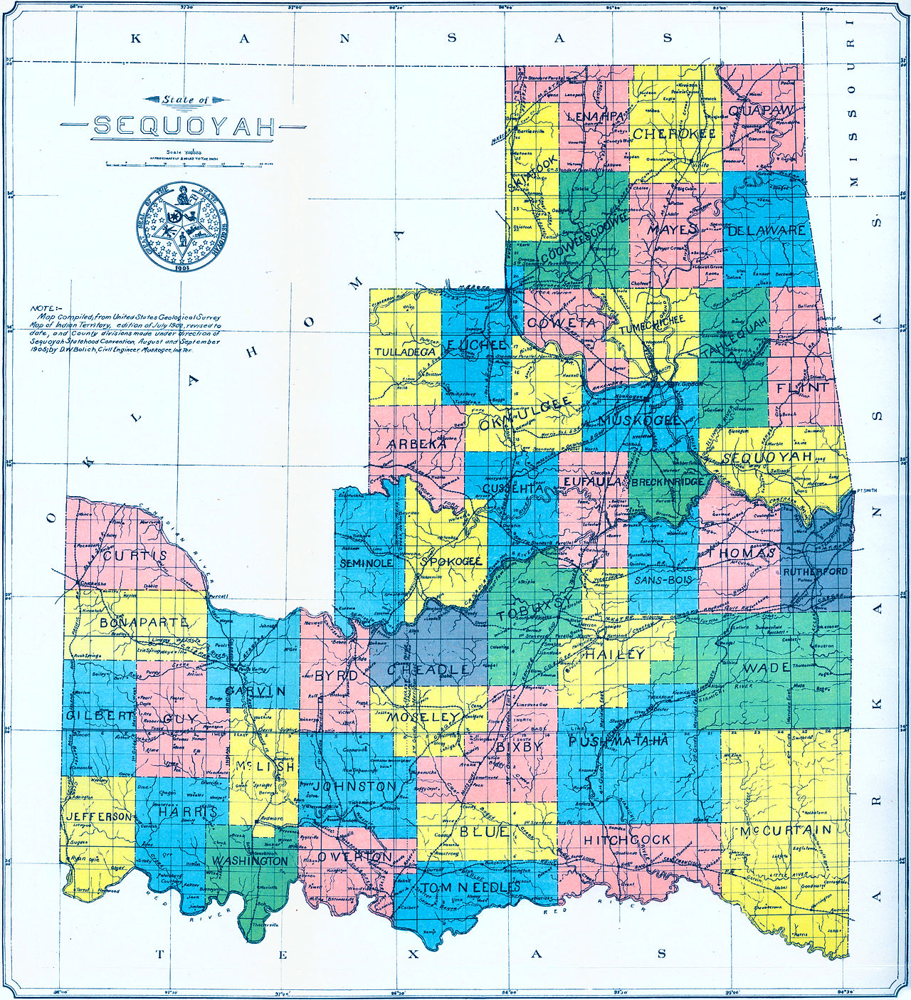

```{r setup, include = FALSE, cache = TRUE, echo = FALSE}
# chunks options:
# hide code and messages by default (warning, message)
# cache everything 
knitr::opts_chunk$set(eval = TRUE, 
                      warning = FALSE, message = FALSE,
                      cache = TRUE,
                      fig.retina = 2,
                      fig.align = "center", dpi = 100)
# Xaringan: https://slides.yihui.name/xaringan/
library("xaringan")
library("xaringanthemer")
library("here")


style_mono_light(base_color = "#00274C",
          link_color = "#006EB2",
          code_highlight_color	= "#FFCB05",
          background_color = "#EFF0F1",
          header_font_google = google_font("Open Sans"), 
          text_font_google = google_font("Open Sans"), 
 #text_font_family = "cm-web-fonts",
 #text_font_url = "https://cdn.jsdelivr.net/gh/aaaakshat/cm-web-fonts@latest/fonts.css",
          base_font_size = "30px",
  text_font_size = "1rem",
 code_font_size = "1rem",
 header_h1_font_size = "1.75rem",
  header_h2_font_size = "1.5rem",
  header_h3_font_size = "1.25rem",
          code_font_google = google_font("Inconsolata"), 
          code_inline_background_color    = "#F5F5F5", 
          table_row_even_background_color = "#E6F0FA",
          outfile = "docs/slides.css",
          extra_css = 
            list(".remark-slide-number" = list("display" = "none")))

```


# Why do we make laws? 

---

background-image: url(figs/odysseus.jpg)
background-size: cover
class: inverse center middle

--

.pull-left[
# To bind others *and our future selves.*
]

---


# Ways to read a constitution

- As political philosophy
- As a historical document 
- As a policy document
- As a structure for policymaking

---

# The takeaways

- Policy language ranges from slightly to extremely ambiguous

  - including language about the distribution of authority to make policy 
  - ambiguity is often necessary for compromise

--

- The interpretations considered legitimate by those in positions of power can change

  - Old laws are often used to address new* issues 

  *often "newly seen as legitimate issues by those in power"

--

-  The distribution of authority to make policy affects policy outcomes

<!-- 
My goal for today is to wrap up our crash course on the US Constitution as the meta structure of policymaking in the US. That means we are going to be spending more time on some parts, like the commerce clause, than other parts that may be interesting, but less important for understanding the distribution of power to make policy. 

Before we jump in, I want to check if anyone has questions about the syllabus. 

Also, please raise your hand if you have questions while I am talking.


--> 

???

So today is mostly going to unfold with me putting some policy language from the constitution and asking why is this important 
--- When answering that question think 
both substantively --- 
What might this enable or constrain? 
--- and structurally ---
How does this allocate decision-making authority --- who does this empower or disempower? 

The Constitution is just a prominent example of a policy text. I considered assigning a section of the Ann Arbor Code of Ordinances alongside this. I am not an expert in constitutional law or the Ann Arbor Code of Ordinances. I want us to focus on how these policies allocate authority and structure decision-making --- I'll be asking for examples, but I'm less interested in you all memorizing examples for each clause of the constitution than being able to think, what does this policy language do? We can read any policy text as a basket of tools and divisions of authority over those tools. I want us to try reading the Constitution like that today. 

I probably have more content than we can get to, and that is fine. This is an exercise in reading policy texts, not a masterclass in constitutional law. 

---

# $\therefore$ The institutional structure of U.S. policymaking

- is contested

- is constantly changing 

- affects policy outcomes


---

class: inverse center middle 

# Separation of powers

<!--The idea is often credited to Montesquieu-->

???

You may have heard this term before, but we'll spend a little time on what those powers are.

This model has been replicated in 
states, 
some cities (though cities vary wildly), 
and in other national governments. 

---

### Article I Powers - Legislative

- 1 - A Senate and House  
- 2.3 - ***Representatives*** and ***Taxes*** shall be apportioned $\rightarrow$ ***Enumeration*** every 10 years  
- 2.5 - House chooses its ***Officers*** and shall have the sole Power of Impeachment  
- 3.5 & 3.6 - Senate chooses their Officers and shall have the sole Power to try Impeachments  
- 4.1 - States prescribe elections, but Congres may alter such Regulations  
- 5.2 - Two-thirds vote to expel a Member  
- 6 - Legislators are paid, privileged from Arrest, may hold no other office  
- 7 - Bills raising revenue start in the House  
- 7.2 & 7.3 - The President's veto can be overruled by two-thirds  

---

### Article I Powers - Legislative (cont.)

- 8 - ***Enumerated Powers*** Power to tax, borrow, regulate **Commerce**, make Rules of **Naturalization** and **Bankruptcy** law, coin Money, fix **Weights and Measures**, punish counterfeit, establish Post Offices and Roads, promote science and arts through **Exclusive Rights to Writings and Discoveries**, constitute Tribunals, punish piracies and felonies on the high Seas, declare **War**, support Armies (for less than two years), maintain a Navy, call the Militia, govern DC and military bases, make all Laws which shall be **necessary and proper** for carrying into execution the foregoing powers, and all other powers vested by this Constitution in the Government of the United States.

---

### The Commerce Clause

> "To regulate Commerce with foreign Nations, and among the several States, and with the Indian Tribes"

---

***Wickard v. Filburn*** (1942), the Supreme Court upheld the New Deal farm subsidies (and corresponding quotas) and crop insurance programs of the Agricultural Adjustment Act

***Katzenbach v. McClung*** (1964), the Court held that Congress acted within its power under the Commerce Clause in forbidding racial discrimination in restaurants in the Civil Rights Act of 1964

***United States v. Morrison***  (2000), the Court held that parts of the Violence Against Women Act of 1994 were unconstitutional

---

### Article I Powers - Legislative (cont.)

- 9 - Congress ***may not***: suspend **Habeas Corpus**, issue a bill of **attainder**, pass **ex post facto** law, tax exports, grant Titles of Nobility
- 9.8 - No person holding any office shall accept any present **Emolument**, Office, or Title, of any kind whatever, from any foreign State

- 10 - States **may not**: enter into a treaty, coin Money, pass ex post facto law, grant Titles of Nobility, tax imports or exports (except for inspection), keep troops, or engage in War without the Consent of Congress

---

### Article II Powers - Executive

1.1 - A president with 4-year terms 

1.2 & 1.3 - Electoral college

1.7 - The President is paid, shall not receive any other **Emolument** 

2 - The President shall be **Commander in Cheif**, may grant **partons** (except in Cases of Impeachment), may make **treaties** (with consent of two-thirds of the Senate), appoint all **Officers of the United States** (with consent of the Senate), "but the Congress may by Law vest the Appointment of such inferior Officers, as they think proper, in the President alone, in the Courts of Law, or in the Heads of Departments." 

---

### Article II Powers - Executive (cont.)

3 - Shall give a **State of the Union** and "shall take Care that the Laws be faithfully executed." 

4 - "Shall be removed from Office on Impeachment for, and Conviction of, Treason, Bribery, or other high Crimes and Misdemeanors."

---

### Article III Powers - Judicial

1 - Federal judges serve for life, may not have their pay cut.

2 - Cases in **Law** and **Equity**, **appellate Jurisdiction**, "Trial of all Crimes, except in Cases of Impeachment, shall be by Jury."

> In all Cases affecting Ambassadors, other public Ministers and Consuls, and those in which a State shall be Party, the supreme Court shall have **original Jurisdiction**. In all the other Cases before mentioned, the Supreme Court shall have **appellate Jurisdiction**, both as to Law and Fact, with such Exceptions, and under such Regulations as the Congress shall make.- Article III, Section 2.

---

3 - "Treason against the United States, shall consist only in levying War against them, or in adhering to their Enemies, giving them Aid and Comfort."

---

# Division of powers across branches: values

Article 1 and Article 2 are rooted in two different kinds of representative democracy.

Article 3 is rooted in the idea of wise arbitration, extended to include the authority to restrain the democratic branches through **judicial review**, where a court strikes laws that it decides are **unconstitutional** (see *Marbury v. Madison*). Judicial review makes the courts a **veto point**.

---

# Division of powers across branches: interaction

- Presidential vetos

- Judicial review and **deference** (e.g., the *Chevron* doctrine)

- Legislative delegation 

---

# Delegation of powers

- From the legislative branch to the executive branch

- From legislative to independent commissions (usually, technically part of the executive, but powers are contested! For example, FERC, FCC, GAO)

- From higher levels of the executive (president, directors) to lower levels of the bureaucracy 

- From the federal government (legislative or executive) to states (occasionally also counties, municipalities, nonprofits, companies)

<!-- for example, contractors fighting war make key decisions, sub-delegated from the military) -->

---

## [Article IV](https://constitutioncenter.org/interactive-constitution/article/article-iv) - States' Relations

1 - **Full Faith and Credit shall be given in each state** 
--
(the courts of one state will enforce laws or judicial decisions of other states)

--

2.1 - Privileges and immunities of **individuals**

--

> A corporation is  “the mere creation of local law” and can “have no legal existence beyond the limits of the sovereignty" (*Paul v. Virginia*)


---

## [Article IV](https://constitutioncenter.org/interactive-constitution/article/article-iv) - States' Relations (cont.)

2.2 - Extradition Clause

--

2.3 - Fugitive Slave Clause
>"No person held to Service or Labour in one State, under the Laws thereof, escaping into another, shall, in Consequence of any Law or Regulation therein, be discharged from such Service or Labour, but shall be delivered up on Claim of the Party to whom such Service or Labour may be due."

---

2.3 - New States may be admitted by Congress

2.4 - The United States shall guarantee to every State in this Union a Republican Form of Government, and shall protect each of them against Invasion; and on Application of the Legislature, or of the Executive (when the Legislature cannot be convened) against domestic Violence.

---
.right-column[


]

.left-column[
1905  State of Sequoyah Constitutional Convention

After the [Curtis Act](https://nativeheritageproject.com/2013/08/17/the-curtis-act-of-1898/) claimed to abolish many national governments with which the U.S. had treaties.
]
???

including:
- Cherokee
- Choctaw
- Chickasaw
- Creek (Muscogee)
- Seminole

Oklahoma was then admitted as a white state


---

## Article V - Amendment Process

The Congress, whenever two-thirds of both Houses shall deem it necessary, shall propose Amendments to this Constitution, or, on the Application of the Legislatures of two-thirds of the several States, shall call a Convention for proposing Amendments, which, in either Case, shall be valid to all Intents and Purposes, as Part of this Constitution, when ratified by ***the Legislatures of three-fourths of the several States***, or by Conventions in three fourths thereof, as the one or the other Mode of Ratification may be proposed by the Congress; Provided that no Amendment which may be made prior to the Year One thousand eight hundred and eight shall in any Manner affect the first and fourth Clauses in the Ninth Section of the first Article; and that no State, without its Consent, shall be deprived of its equal Suffrage in the Senate.


---

Read as a policy document, a constitution allocates **authorities** to make, veto, or enforce policy. 

--

The U.S. Constitution and institutions that copy it attempt to separate Legislative, Executive, and Judicial powers. In practice, authorities are often **unclear or contested**.

--

Authorities are **reinterpreted** to meet political demands of the day. For example, Congress has used ***commerce clause*** authority to 
- Manage food production and other New Deal programs responding to the Great Depression 
- Prohibit states and businesses from enforcing racial segregation (Civil Rights Act, 1964)
- Allow sexual assault survivors to sue in federal court (VAWA, 1994)<!-- (Violence Against Women Act, 1994), but the Supreme Court struck this portion of the Act--> 
- Incentivize people to have health insurance (ACA, 2010)