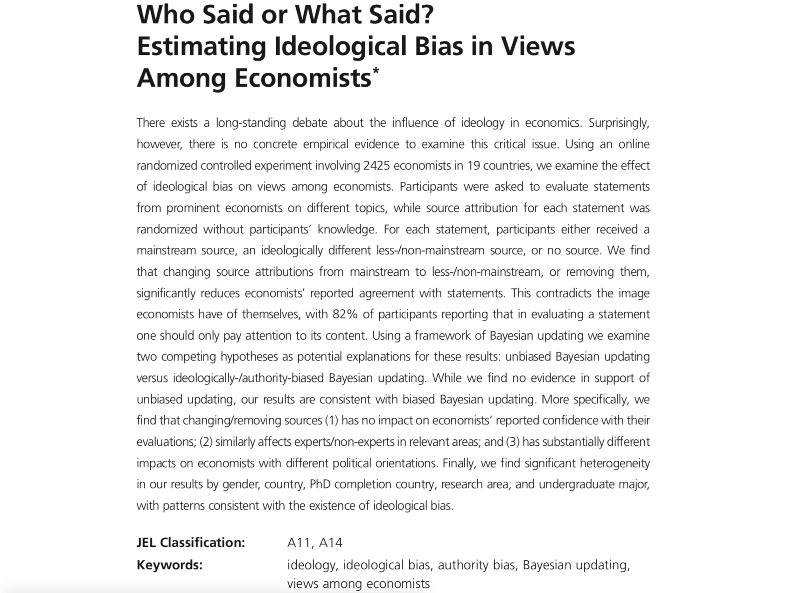
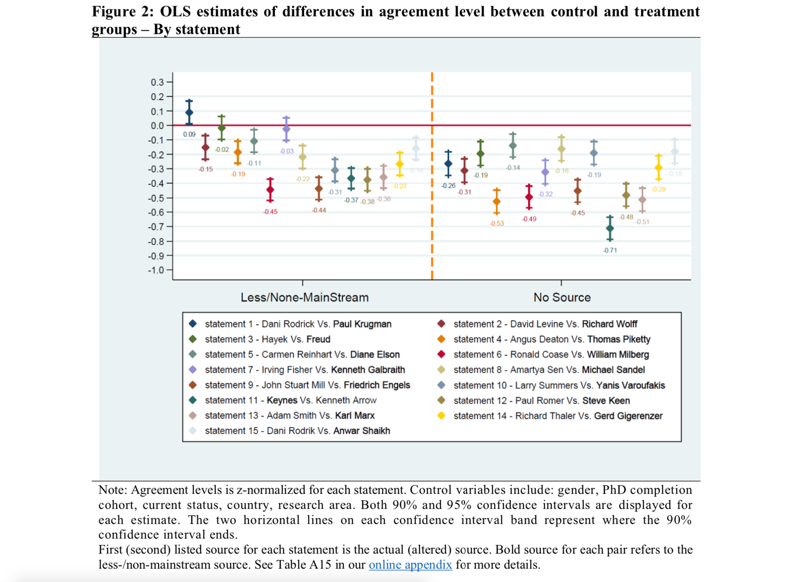

# All of those quotes were misattributed. If you found yourself persuaded by them, was it because of the content or the speaker? 

This study found that economists evaluated these statements differently depending on who it was attributed to. Male economists were especially susceptible to the messenger effect, where non-rational processes like loyalty and legitimacy affect assessments of truth.

<!--background-image: url(economists_abstract.png)
background-size: cover-->

---

> “Civil government, so far as it is instituted for the security of property, is in reality instituted for the defense of the rich against the poor, or of those who have some property against those who have none at all.” *- ~~Karl Marx~~ Adam Smith* Book 5, 1. of the Expenses of the Sovereign or Commonwealth, 2: Of the Expense of Justice.

---

> "Society does not consist of individuals but expresses the sum of interrelations, the relations within which these individuals stand." *- ~~Adam Smith~~ Karl Marx, Foundations of the Critique of Political Economy*

---

> "The laws of property have made property of things which never ought to be property, and absolute property where only a qualified property ought to exist. They have not held the balance fairly between human beings, but have heaped impediments upon some, to give advantage to others; they have purposely fostered inequalities, and prevented all from starting fair in the race." *- ~~Friedrich Engels, German philosopher and co-author of The Communist Manifesto~~ John Stuart Mill, Principles of Political Economy*

---

<!--background-image: url(economists.png)
background-size: cover-->

---

# Even this one was a trick

> "It is only in combination with particular, non-rational impulses that reason can determine what to do.” *- ~~Deborah Stone~~ Friedrich von Hayek*
