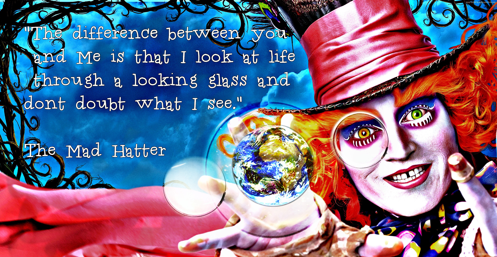
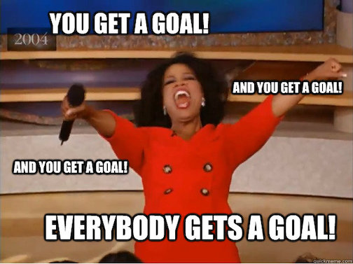
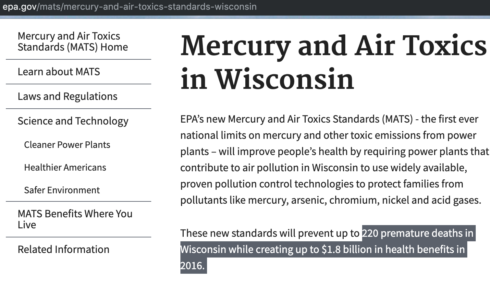
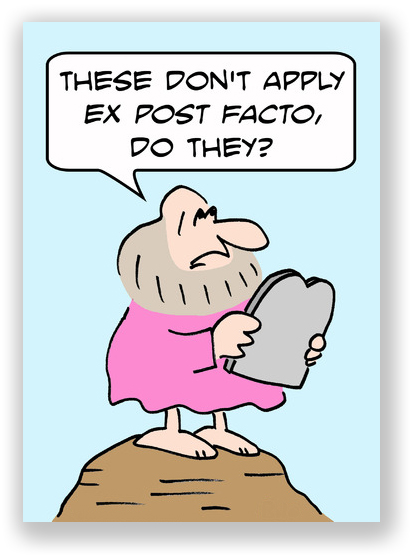
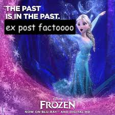
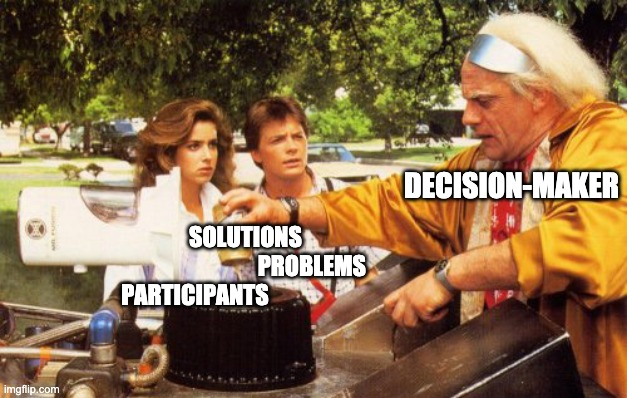
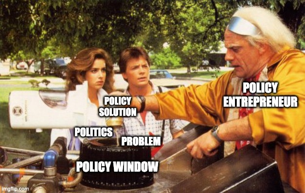
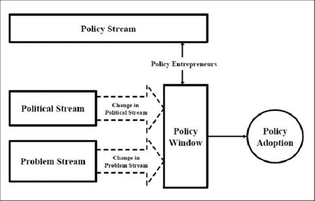

```{r setup, include = FALSE, cache = TRUE, echo = FALSE}
# chunks options:
# hide code and messages by default (warning, message)
# cache everything 
knitr::opts_chunk$set(eval = TRUE, 
                      warning = FALSE, message = FALSE,
                      cache = TRUE,
                      fig.retina = 2,
                      fig.align = "center", dpi = 100)
# Xaringan: https://slides.yihui.name/xaringan/
library("xaringan")
library("xaringanthemer")
library("here")


mono_light(#base_color = "#003333",
          #link_color = "#000080",
          #background_color = "#FAF0E6", # linen
          header_font_google = google_font("PT Sans"), 
          text_font_google = google_font("Old Standard"), 
          text_font_size = "30px",
          padding = "10px",
          code_font_google = google_font("Inconsolata"), 
          code_inline_background_color    = "#F5F5F5", 
          table_row_even_background_color = "#E6F0FA",
          extra_css = 
            list(".remark-slide-number" = list("display" = "none")))

```

```{r, eval = FALSE, include= FALSE}
# setup
devtools::install_github("yihui/xaringan")
devtools::install_github("gadenbuie/xaringanthemer")
install.packages("webshot")
# webshot::install_phantomjs()

library(webshot)

# export to pdf
file <- here("talk/stone.html")
webshot(file, "talk/stone.pdf")
```

In part 1, Stone introduced the idea that the metaphors we use to understand society, reasoning, and policymaking shape policy outputs and outcomes.

In part 2, Stone introduces five big "goals" (more like values) that motivate policy demands.

---



???

Different metaphors allow different ways of seeing society and policymaking. 

Different goals are different qualities we value in our society and policy. 

Do you recall why the hatter in *Allice in Wonderland* is "mad?"

---

## Example: Mercury from power plants

--

- 2000: EPA finds that mercury is harmful and should be regulated
- 2005: EPA finds it lacks authority to regulate
- 2012: EPA finds it does have authority and finalizes a rule regulating mercury
- 2015: EPA finds the rule's benefits to be greater than its costs
- 2018: EPA finds the rule's benefits to be less than its costs

???

Why did the EPA flip-flop on the question of whether it should regulate mercury pollution from power plants? 

Why did it flip-flop on whether the benefits or costs were greater? 

---

<!--class: inverse center -->

# #Goals


### Equity, welfare, efficiency, liberty, security, democracy 

(These might better be called values and criteria, rather than goals. I think of goals as things that are, in principle, clearly achievable outcomes, which, I'd argue, none of these are. Rather, these are values that motivate us and criteria by which we evaluate policy ideas.)

---

<!--class: inverse center -->

## Equity

> "Distributions --whether of goods and services, wealth and income, health and illness, or opportunity and disadvantage--are at the heart of policy controversies" (page 39)

Know *Concepts of Equality* in the table on page 47

---

### How much mercury is "safe" (and for whom)?

--

- The average U.S. resident
- People who live near power plants
- People who eat fish
- Children 

Over 1 million comments: 

>“The amount of methyl-mercury and other bioaccumulative chemicals consumed by Alaskans (especially Alaskan Natives) could potentially be much higher than is assumed...The Alaska Native mortality rate for babies, which, according to the CDC, is 70% higher than the United States average.


---

EPA in 2000:

>  [nothing]

EPA in 2002:  

> "Other types of entities not listed could also be affected."

EPA in 2004: 

>“Some subpopulations in the U.S., such as Native Americans, Southeast Asian Americans, and lower-income subsistence fishers, may rely on fish as a primary source of nutrition and/or for cultural practices. Therefore, they consume larger amounts of fish than the general population and may be at a greater risk of the adverse health effects from Hg due to increased exposure.”

---


EPA in 2012:

>"high risk among communities included “Hispanic, Vietnamese, and Laotian populations in California and Great Lakes tribal populations (Chippewa and Ojibwe)"

2012 final rule: “minority, low income, and indigenous populations.”

???

Which of Stone's *Dimensions of Equality* (page 47) did policy actors draw on in this example? 
- Membership
- Merit
- Rank
- Group-based Distributions
- Need
- Value 
- Lotteries
- Competition
- Elections

---

<!--class: inverse center -->

## Efficiency 

*Getting the most for the least* or *achieving an objective for the lowest cost* 

But, efficiency doesn't tell you *where* to go, only that you should get there with the least possible effort.

---

### Is regulating Mercury efficient? 

What would we like to know to answer this question?

---

Annual Cost 

- EPA in 2011: $9.6 billion
- EPA in 2018: $7.4-9.6 billion
 
--

Annual benefits: 

- EPA in 2011: $90 billion
- EPA in 2018: $4-6 million

???

How might one come up with these numbers?

If a power plant is in a rich neighborhood, is it more harmful?

Do we care more about a wealthy person's soil, a high-income person's lost day of work?
 
---

<!--class: inverse center -->

### Equity, Efficiency, and Numbers in policymaking

---

EPA in 2015:

>Murcry Air Toxics Standards and the Cross‐State Air Pollution Rule are estimated to provide annual benefits of $150‐$380 billion and prevent up to 46,000 premature deaths, 540,000 asthma attacks, 13,000 emergency room visits and over 2 million sick days or missed workdays each year.

---

EPA in 2017:

>"low-income and minority communities located in proximity to [power plants] may have experienced an improvement in air quality as a result of the emissions reductions."

> Previous EPA failed to "address lower household energy bills for low-income households [and that] workers losing jobs in regions or occupations with weak labor markets would have been most vulnerable."

---



---

- 2000 - EPA finds that mercury is harmful
  - Risk assessed for U.S. population average
- 2002 - EPA publishes a draft rule
  - Only assessed harms to industry
- 2004 - Revised proposed rule
  - identifies "subpopulations at risk"
- 2005 - EPA finds it is not "appropriate and necessary."
- 2008 - Court finds that EPA violated Clean Air Act <!--unusual to force regulation, usually conservative, even when progressives are on the court--> 
- 2012 - Rule finalized
  - revised to protect "vulnerable populations" based on new studies
- 2015 - Court finds EPA must consider costs 
- 2015 - EPA finds benefits > costs
- 2017 - EPA identifies costs to low-income consumers and workers
- 2018 - EPA finds benefits < costs
- 2020 - EPA [rule](https://www.washingtonpost.com/climate-environment/the-epa-is-about-to-change-a-rule-cutting-mercury-pollution-the-industry-doesnt-want-it/2020/02/16/8ebac4e2-4470-11ea-b503-2b077c436617_story.html)

???

The long (and ongoing) policy process for the Mercury Rule illustrates the role of both science and politics.

Without the scientific finding that Mercury was hazardous, the Bush-era EPA would not have had to regulate it.

Without studies on the health effects, it would have been written to protect average Americans.

---

### Efficient markets

Q: What makes a policy of market-based distribution efficient? 

--

A: It depends on your policy goal.

Recall Leigh Raymond's study of [markets for pollution rights](https://scholars.org/podcast/paying-pollution). Under what conditions would we say these markets are efficient policy?

---

[DOJ wants more time on merger reviews, price-fixing cases because of pandemic](https://www.politico.com/news/2020/03/21/doj-merger-reviews-coronavirus-140669)

> Prosecutors are also asking to stop the clock on price-fixing and bid-rigging cases, a move that would ensure that the pandemic doesn’t let companies that fixed prices on generic drugs off the hook.

>Under current law, all mergers valued at more than $94 million have to be notified to the United States' two antitrust agencies, which have 30 days to decide whether to undertake an in-depth review. The legislative proposal would change that to 45 days. 

???

Who might say this policy change increases efficient market-based distribution? 

Who might say this decreases efficient market-based distributions? 

What is the root of their disagreement? 

<!---

# Welfare

<blockquote class="twitter-tweet"><p lang="en" dir="ltr">Grappling with the politics of science, expertise, and public trust right now? Check out the new episode of The Received Wisdom! <a href="https://twitter.com/Jackstilgoe?ref_src=twsrc%5Etfw">@Jackstilgoe</a> &amp; I talk w/<a href="https://twitter.com/benjaminjpauli?ref_src=twsrc%5Etfw">@benjaminjpauli</a> about <a href="https://twitter.com/hashtag/FlintWaterCrisis?src=hash&amp;ref_src=twsrc%5Etfw">#FlintWaterCrisis</a>, science superheroes, and lay knowledge in a &quot;post-truth&quot; era. <a href="https://t.co/A8hwj9NLYU">https://t.co/A8hwj9NLYU</a> <a href="https://t.co/t2RCSwx3BN">pic.twitter.com/t2RCSwx3BN</a></p>&mdash; Shobita Parthasarathy (@ShobitaP) <a href="https://twitter.com/ShobitaP/status/1237412816069357568?ref_src=twsrc%5Etfw">March 10, 2020</a></blockquote> <script async src="https://platform.twitter.com/widgets.js" charset="utf-8"></script>


--->

## Liberty

The Justice Department has asked Congress for the ability to ask chief judges to detain people indefinitely without trial during emergencies. [Read more...](https://www.politico.com/news/2020/03/21/doj-coronavirus-emergency-powers-140023)

(know Concepts of Liberty on page 115, and Paradoxes of Liberty on page 124)

<!--- 

# Security


--->


# Key terms from Part II:

(* = terms that have been on past exams; this does not mean they will not appear again--I select terms for each exam at the end of the semester, focusing on terms that are important to know in this historical moment, that you would know if you read thoughtfully, but that may not be obvious if you did not.)

- Equity (will not be on the exam, too complex) 

*As a means of distribution:*  

- Membership*
- Merit*
- Rank
- Group-based Distributions
- Need
- Value 
- Lotteries
- Competition 
- Elections

---

- Income inequality 
- Democratic inequality (I would call it *political inequality*)

---

- Efficiency*
- Social welfare*
- neoliberalism 
- Keynesianism
- Rationality 
- Full information*
- Voluntarism
- Externalities*
- Public goods*

---

- Welfare (careful with this one, read before you answer)
- Intrinsic vs. instrumental needs*
- Material vs. symbolic needs
- Individual vs. relational needs
- Moral hazard*
- Absolute vs. relative needs

---

- Liberty
- Cumulative harms
- Material harms
- Amenity effects
- Psychic harms
- Spiritual and moral harms*
- Negative liberty*
- Positive liberty*
- Positive obligations
- Paternalism
- Freedom of speech (will not be on the exam, too complex)
- Multiculturalism (will not be on the exam, too complex)
- Polity

---

- Security (will not be on the exam, too complex)
- Low probability/high impact events
- Precautionary principle
- Risk assessment/analysis
- psychological security
- Surveillance, border control, prisons, weapons (will not be on the exam, too obvious)

---

# Example of key term posts/exam answers 

> ***ex post facto* laws** are laws that punish people for actions that occurred prior to the law's enactment. In the U.S., they are considered violations of due process rights and prohibited by Article 1, Section 9 of the U.S. Constitution. **This concept is important to public policy because** it restricts policy options to rules about future behavior. **An example** of an *ex post facto* law would be making it illegal to have vaped any time in the past ten years"--such laws are broadly seen as unfair and thus illegitimate because one should be able to know what rules they are to follow.





---

> **Transparency requirements** are policies that give citizens, journalists, and affected parties' rights to know what government officials are doing. **These are important to public policy because** policymakers make different decisions if those decisions could face public scrutiny and because more stakeholders may be able to participate in more open policy processes. However, they may cost public resources and time, potentially delaying policy. Critics call them "red tape." *Examples include* requirements to give the public notice of or access to meetings (as required by Wisconsin's *Open Meetings Law*), requirements to publish draft policies (as required by the *Administrative Procedures Act*), requirements to study the effects of government decisions (such as Environmental Impact Statements required by the *National Environmental Policy Act*), or release government records upon request (as required by the *Freedom of Information Act*).

<blockquote class="twitter-tweet"><p lang="en" dir="ltr">Today’s <a href="https://twitter.com/washingtonpost?ref_src=twsrc%5Etfw">@washingtonpost</a> <a href="https://twitter.com/tiktok_us?ref_src=twsrc%5Etfw">@tiktok_us</a> brought to you by <a href="https://twitter.com/dataeditor?ref_src=twsrc%5Etfw">@dataeditor</a> and FOIA officers <a href="https://t.co/fgVDRGFa03">https://t.co/fgVDRGFa03</a> <a href="https://t.co/2pPtwPi0mD">pic.twitter.com/2pPtwPi0mD</a></p>&mdash; Dave Jorgenson 💡 (@davejorgenson) <a href="https://twitter.com/davejorgenson/status/1154409369670434819?ref_src=twsrc%5Etfw">July 25, 2019</a></blockquote> <script async src="https://platform.twitter.com/widgets.js" charset="utf-8"></script>

> The **garbage can model** is a model of decision-making developed by Cohen, March, and Olsen, who argue that organizations are "organized anarchies" and make decisions based on the flow of problems, solutions, and participants into the choice opportunities they call "garbage cans." It was the foundation of Kingdon's "Multiple Streams" metaphor. **It helps us understand public policy because** it suggests that policy decisions are made with limited information, problem definitions, and choices--we should not expect decision-makers to make rational or comprehensive decisions. **Examples** could include almost any policy. One example from our class was Parisi's landfill gas initiative that connected the problem of what to do with the gas with the solution to inject it into the pipeline that just happened to run through the landfill, which only came up because a consultant on a previous project (a participant) suggested it. It was not the result of strategic planning.



> The **multiple streams model** is a model of policymaking developed by Kindon, who argues that policy results from a change in the problems, policy (solutions), and/or political "streams" that create windows of opportunity for a policy that brings these streams together. It is based on the garbage can model. **It helps us understand public policy because** it suggests that policy decisions are made only when certain conditions occur, which requires changes in the political environment, problem definitions, or available solutions. It also suggests that policies are not the result of rational, linear thinking, but rather the linking of available problems, solutions, and political will. **An example** would be surveillance policies that were not politically acceptable solutions to government counter-terrorism efforts until the change in the political stream after the 9/11 attacks.



