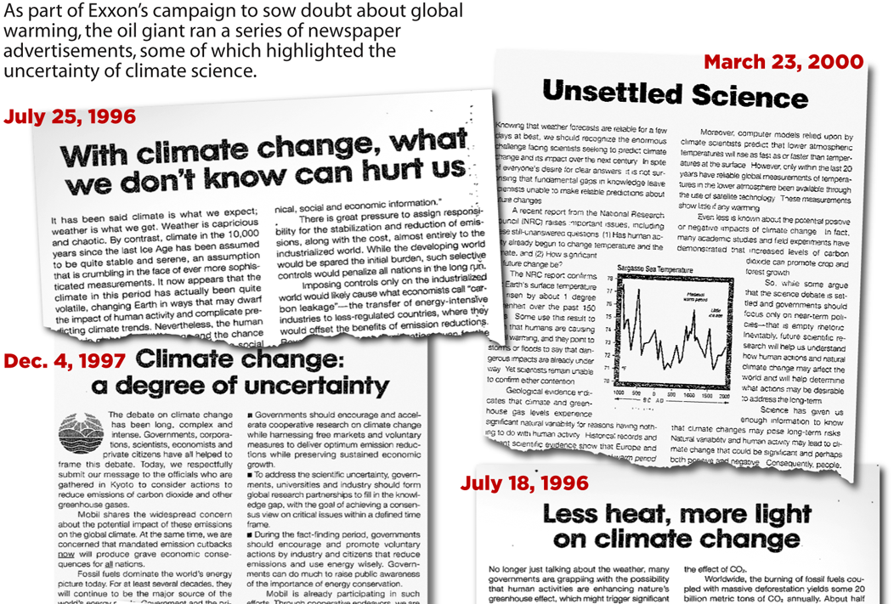
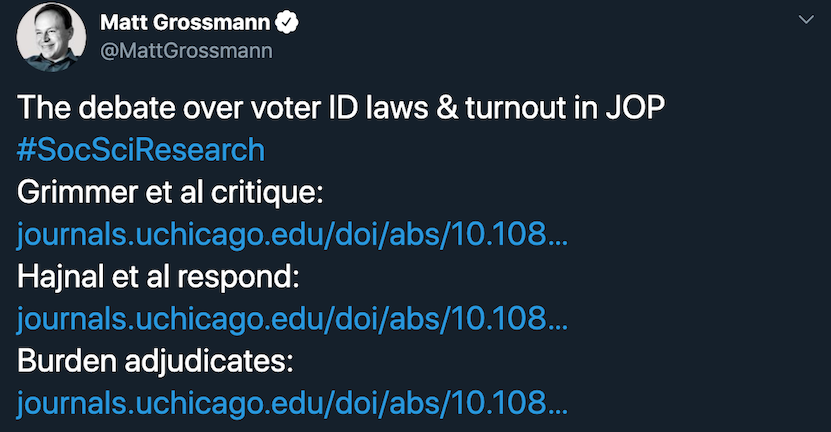
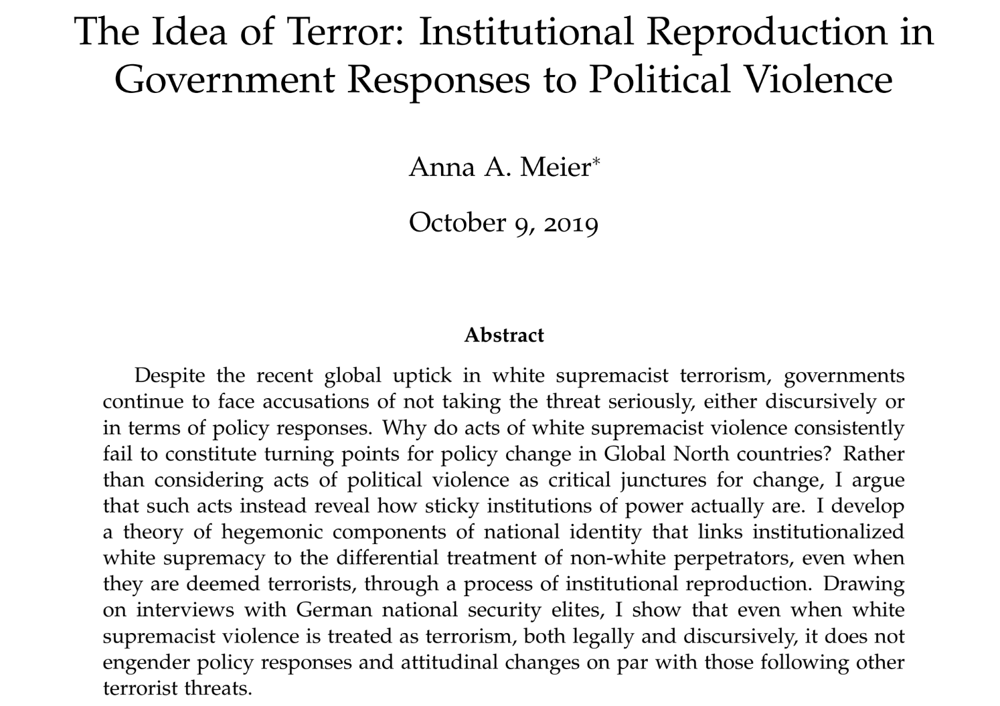
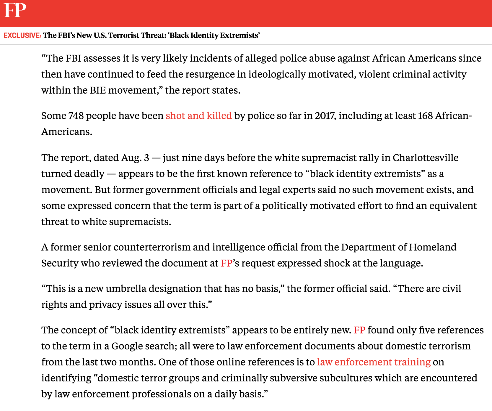
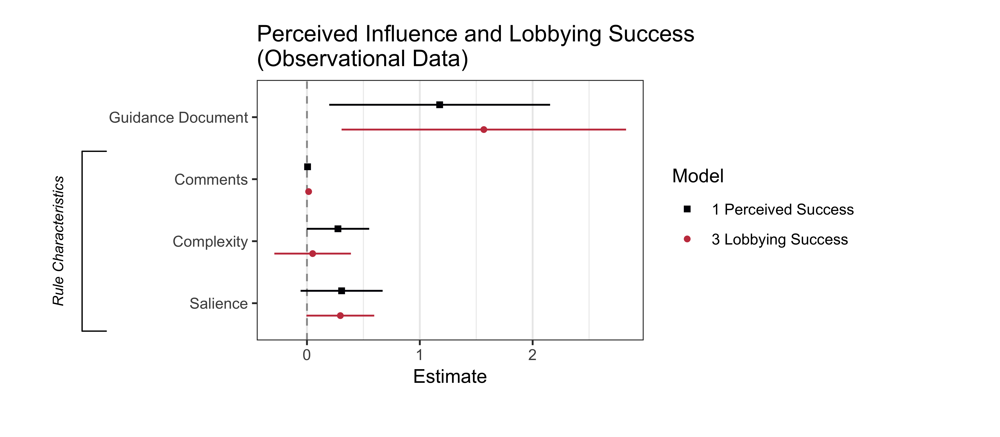

```{r setup, include = FALSE, cache = TRUE, echo = FALSE}
# chunks options:
# hide code and messages by default (warning, message)
# cache everything 
knitr::opts_chunk$set(eval = TRUE, 
                      warning = FALSE, message = FALSE,
                      cache = TRUE,
                      fig.retina = 2,
                      fig.align = "center", dpi = 100)
# Xaringan: https://slides.yihui.name/xaringan/
library("xaringan")
library("xaringanthemer")
library("here")


mono_light(#base_color = "#003333",
          #link_color = "#000080",
          #background_color = "#FAF0E6", # linen
          header_font_google = google_font("PT Sans"), 
          text_font_google = google_font("Old Standard"), 
          text_font_size = "30px",
          padding = "10px",
          code_font_google = google_font("Inconsolata"), 
          code_inline_background_color    = "#F5F5F5", 
          table_row_even_background_color = "#E6F0FA",
          extra_css = 
            list(".remark-slide-number" = list("display" = "none")))

```

```{r, eval = FALSE, include= FALSE}
# setup
devtools::install_github("yihui/xaringan")
devtools::install_github("gadenbuie/xaringanthemer")
install.packages("webshot")
# webshot::install_phantomjs()

library(webshot)

# export to pdf
file <- here("talk/stone.html")
webshot(file, "talk/stone.pdf")
```


---

"Harm" 

- Assumes agreed upon concepts of good and bad

--

"Intervention" 

--

- An unspoken assumption about rights

--

- Asserts negative liberties: sacred principles to be given weight regardless of harms
- Religion, Speech, Press, etc.

--

- The status quo

---

>"Lawers thus *represent* their clients no only in the senes of speaking for them but in the artistic sense of casting their behavior in a particular light" - Stone

In this class, we are focusing on public policy in the U.S., but if you are interested in International Relations (which includes policy among countries) or Comparative Public Policy (comparing policy across countries), here are some resources:  


IR Scholars have you covered!

[THREAD]

At the federal level, nationalization https://www.uschamber.com/series/your-corner/can-the-government-nationalize-business

<div class="tns-plotly__iframe-wrapper" style="padding-top: 88.888888888889%; position: relative; overflow: hidden; height: 0;"><iframe src="https://cdn.knightlab.com/libs/timeline3/latest/embed/index.html?source=1sDjYVrbQRp9rbQGKBwDd1kEKM-xdZhlOnHeCZmVN4K0&font=Default&lang=en&initial_zoom=2&default_bg_color=fff6f6?autosize=True&modebar=false&link=false" style="position: absolute; display: block; top: 0; left: 0; width: 100%; height: 100%; border: none;"></iframe></div><p><em>Source: <a href="https://thenextsystem.org/history-of-nationalization-in-the-us?mc_cid=985c978068&mc_eid=70d0504985">A History of Nationalization in the United States: 1917-2009</a></em></p>

## Framing problems:

"Moral Hazard" 
- An analytic tool to avoid unintended consequences
--

- Makes an unspoken assumption about human nature

--

"Harm" 
- Assumes agreed upon concepts of good and bad

--

"Intervention" 
--

- An unspoken assumption about rights
--

- Asserts negative liberties: sacred principles to be given weight regardless of harms
--

- Religion, Speech, Press, etc.
--

- The status quo

---

> "It is only in combination with particular, non-rational impulses that reason can determine what to do.” 
*- Deborah Stone*

---

class: inverse center

# Famous political economists

---

> "Civil government, so far as it is instituted for the security of property, is in reality instituted for the defense of the rich against the poor, or of those who have some property against those who have none at all." *- Karl Marx*

---

> "Society does not consist of individuals but expresses the sum of interrelations, the relations within which these individuals stand" *- John Stuart Mill, On Liberty*

---

> "The laws of property have made property of things which never ought to be property, and absolute property where only a qualified property ought to exist. They have not held the balance fairly between human beings, but have heaped impediments upon some, to give advantage to others; they have purposely fostered inequalities, and prevented all from starting fair in the race." *- Friedrich Engels, German philosopher and coauthor of The Communist Manifesto*

---

background-image: url(economists_abstract.png)
background-size: cover

---

> “Civil government, so far as it is instituted for the security of property, is in reality instituted for the defense of the rich against the poor, or of those who have some property against those who have none at all.” *- ~~Karl Marx~~ Adam Smith*

---

> "Society does not consist of individuals but expresses the sum of interrelations, the relations within which these individuals stand" *- ~~John Stuart Mill,  On Liberty~~ Karl Marx, Foundations of the Critique of Political Economy*

---

> "The laws of property have made property of things which never ought to be property, and absolute property where only a qualified property ought to exist. They have not held the balance fairly between human beings, but have heaped impediments upon some, to give advantage to others; they have purposely fostered inequalities, and prevented all from starting fair in the race." *- ~~Friedrich Engels (1820 1895), German philosopher and coauthor of The Communist Manifesto~~ John Stuart Mill, Principles of Political Economy*


---

background-image: url(economists.png)
background-size: cover

---

> "It is only in combination with particular, non-rational impulses that reason can determine what to do.” *- ~~Deborah Stone~~ Friedrich von Hayek*

---

exclude: true

# Incentives 

<div style="font-size: 18px">

|  | Rationality Model | Polis Model | 
| --- | --- | --- |
|Giver | Unified entity capable of consistent and rational decisions | Entity may have internal conflict and inconsistent decisionmaking |
|Target | Unified entity capable of consistent and rational decisions, will change current behavior for future rewards | Entity may have internal conflict and inconsistent decisionmaking, actors may have different timeframes and motives that change over time |
|Incentive | Meaning and value to target is clear | May have different meanings and values to the garget than the giver intends; may have symbolic meanings in conflict with material values |
|Rewards | The more rewards offered, the more behavior change | May create alliances between givers and targets--rewards may give targets power to get more rewards without behavior change | 
|Sanctions | The more sanctions threatened, the more behavior change | May create conflict between givers and targets or harden the target's resistance. May hurt people one is trying to protect instead of altering their behaviors |

</div>


## Perverse incentives

---

# Rules

Social coordination by clarifying expectations for how people must act if they want state support.

A rule may
1. mandate behavior

1. confer powers
--

 - rules for contracts, wills, and lawsuits. 
 - rules that agencies and local governments must follow to make policy 
 
 <!-- EXAMPLES OF THE FIRST? THE SECOND? many of your memos to the legislature are the second-->
 
See H. L. A. Hart, *The Concept of Law*

---

Why we follow rules

- sanctions 
- legitimacy - perceived as good and right in how they distinguish like and unlike

---

Components of rules:

If [*action* + *context*], then [*rule*].

This is not as easy as it sounds!

>"Lawers thus *represent* their clients no only in the senes of speaking for them but in the artistic sense of casting their behavior in a particular light"-Deborah Stone

Rules classify actions and situations, creating consequences for each. 

Thus, rules unite and divide. For example, 
- banks or polluters by size
- people by age or location


---

## Rules and rulemaking reshape coalitions

Political scientists call this "policy feedback."

> “a new policy creates a new politics"--E.E. Schattschneider

- Civil War veterans' and widows' pensions (Theda Skocpol, *Protecting Soldiers and Mothers*)
- G.I. Bill after World War II, (Susan Mettler, *Soldiers to Citizens*)
- Medicaid rules affect political participation (Jamila Michener, *Fragmented Democracy*)

<!-- Policy feedback lit -->

---

"Bootleggers and Baptists" coalitions


---

"The Delaware Effect" 


---

"The California Effect"


---

## Making rules 

1. Focusing events inspire big promises
- American Revolution --> U.S. Constitution
- Great Depression --> Social Security Act, New Deal
- Silent Spring --> DDT Ban, Environment Protection Agency 
- Cuyahoga River fire --> Clean Water Act
- 9/11 --> Patriot act, Dept. of Homeland Security
- Great Recession --> Dodd-Frank

<!-- That kind of event never happens again 

These are often dominated by passions rather than science -->

---

**But**, legislators often avoid specifics that would anger any constituent group. Instead, they use
- constituency service 
- logrolling 
- symbolic legislation 

Morris P. Fiorina *Congress: Keystone of the Washington Establishment*

- delegation of broad authority

---

## Precise vs. vague rules


> Perfectly precise rules would require that "a legislator sit at every person's side all through their life, prescribing the exact particulars of their duty." - Plato

<!-- no longer a rule --> 

---

Precise rules --> no discretion
- treat like things alike
- limits discrimination by officials
- predictable
- may be circumvented or become outdated
- symbolize the rule of law

--

Vague rules --> discretion
- allows sensitivity to context and individual differences 
- allows officials to respond creatively to new situations
- allow for *tacit knowledge**: "I can't define it, but I know it when I see it"--Justice Potter Stewart
- symbolize ideals

*See Michael Polanyi, *Personal Knowledge*

---

Do agencies have too much discretion in rulemaking? 

>"The proper goal is to eliminate *unnecessary* discretionary power, not eliminate unnecessary discretionary power."--Kenneth Culp Davis, *Discretionary Justice*, p. 217 

"necessary and proper"? 

"necessary force"? 

Should police need to get a warrant before a search? 

Should judges have discretion in sentencing? 


---

## "Neutral" ("Formal") rules?

>"They refer to typical situations into which anyone may be and in which the existence of such rules will be useful for a great variety of purposes...They do not involve a choice between particular ends or particular people, because we just cannot know beforehand by whom and in what way they will be used." -- Friedrich Hayek

<!-- the road to surfdom fp 74-75 -- example traffic laws " -->

Examples? 

---

Positive economics: 

> "differences about economic policy among disinterested citizens derive predominantly from different predictions about the economic consequences of taking action--differences that in principle can be eliminated by the progress of positive economics"--Milton Friedman

--

What does it mean to be disinterested? 

<!-- It means that we a group of people who agree on the goal. When do we see this? --> 

---

## Perfectly enforced rules? 

Legal positivism 

> "nine-tenths, perhaps more, of the cases that come before a court are predetermined"--Benjamin Cardozo (a critic of legal positivism)

To what extent should algorithms enforce laws? 

--

- Three strikes laws
- mandatory minimums
- AI

---

Is AI good or bad for law enforcement? (see ["risk score" sentencing debate](https://www.washingtonpost.com/news/monkey-cage/wp/2016/10/17/can-an-algorithm-be-racist-our-analysis-is-more-cautious-than-propublicas/))


---

## Enforcement in practice

Rules of thumb

> "If you limit your greed to a $1 Million [Ponzi scheme](https://player.fm/series/the-dream), you aren't going to get any flack from the SEC."--Securities and Exchange Commissioner

--

Officials teach targets the rules of the game (Lapinski, *Street-Level Bureaucracy*)
- e.g. Public housing officials teach elderly or White applicants how to qualify for "emergency" housing. 

---

class: center inverse

# Facts and Persuasion

> "To be political, to be in a polis, meant that everything was decided through words and persuasion and not through force and violence"--Hannah Arendt

---

background-image: url(facts.jpg)
background-size: cover

---

class: center

Science, evidence, logic, reason, rationality

vs. 

Rhetoric, bias/loyalty, emotion/passion

---

## Persuasion

How do we distinguish *information and education* from *propaganda and indoctrination*?

--

What about the "use of symbols to gain acceptance or rejection of a scientific process" (Lasswell and Kaplan, 1950)? 

--

Are statements doubting human-caused climate change propaganda? 
- always?
- never?
- sometimes?

<!-- I can see arguments in all three ways. If always, then climate science promotion must also be a kind of propaganda, never is the argument that Lasswell and Kaplan offer. Claims about facts are just out of the definition. Sometimes requires criteria, like intentional deception. -->

---



---

background-image: url(smoking-doctor.jpg)
background-size: cover

<!-- is this propaganda? --> 

--

background-image: url(smoking.jpg)
background-size: cover

<!-- is this propaganda? --> 

---

Voting in 1947

> "The registrar registers any qualified person, black or white, if they insist. When a Negro applies, however, she tells them that they will be registered if they insist, but she gives them a quiet, maternal talk to the effect that the time has not yet come for Negros to register in the county. The people are not ready for it now and it would only cause trouble"--V.O. Key, Jr. *Southern Politics*

6 of 13,0000 eligible Black voters registered in this county

---


- The effect of voter ID laws is mostly "deterrent" effects ([DeCrescenzo and Mayer](https://mikedecr.github.io/research/nonvoters/))
- Telling a person they can't vote once 
has lasting effects ([Grimmer and Yoder](https://cpb-us-w2.wpmucdn.com/web.sas.upenn.edu/dist/7/538/files/2019/07/voter_id_deter.pdf))

---


---

To what extent do we revere the U.S. Constitution due to rational analysis of its principles and policy solutions? To what extent is it simply loyalty? 


---

To what extent do we revere the U.S. Constitution due to rational analysis of its principles and policy solutions? To what extent is it simply loyalty? 


---

## Principles vs. loyalties

*Johnson v. M’Intosh* (1823)

- Johnson held a title from the local leaders of the Illinois (Illini) and Miami nations.
- M'Intosh later bought the same land from the U.S. Federal Government.

--

> "Conquest gives a title which the court of the conqueror cannot deny"--Justice Marshall

See Carol Rose, "Possession as the Origin of Property" in *Property and Persuasion, Essays on the History, Theory, and Rhetoric of Ownership*

<!-- Contradictions between principles and policies in the U.S. Constitution do not necessarily undermine the legitimacy of the constitution, but they do suggest that we see it as a policy document, not a religious text. Indeed this is where all of the amendments come from. This is how Brown v Board of Education overruled Plessey vs. Ferguson Many of you will be out in the world of making policy, if you go to law school, con law will teach you what the law says, but this class is about how it can change. --> 

---

## Principles vs. policy and precedent

*Brown v. Board of Education* (1954) reversed *Plessy v. Ferguson* (1896), overruling the "separate but equal" precedent and striking down segregation policies.


<!-- podcast on brown -- amicus? --> 

---

class: inverse center

# Rights

---

## Positive rights vs. normative rights

- Positive: things you can do where the government has stated that it will back you up
- Normative: 
> "We hold these truths to be self-evident: that all men (sic) are created equal, that they are endowed by their Creator with certain unalienable Rights"

--

## Procedural vs. substantive rights

Ensuring substantive rights often requires procedural rights, e.g., a grievance process.

<!-- for example, my dad had a stroke, which usually automatically qualifies you for social security disability. However, his boss at the mill was kind and kept paying him as if he was working part-time for a few months. However, this automatically disqualified him from SSD, and it was a 3-year process to reverse that decision. 

unofficial catagories and policy outcomes https://twitter.com/nberpubs/status/1203018769259474945

It is that definition, that classification that made all the difference in whether he had rights.


TO ADD: TORTS, "REASONABLE MAN RADIOLAB-->

---

## Definitions and labels in policy determine rights because different policies apply to different categories of actors.

---

What is affordable housing?

Does it matter?

---

What is terrorism? 

--

- violence on behalf of fringe factions of "Islam"?

- violence "defending the rightful place of the White Race"?

<!-- I put Islam and White race in quotes here because most people in both of those groups disagree with how those groups are claiming and defining those labels" -->

Does it matter? 

--

Does the symbolic power of the label "terrorism" translate to policy response?

<!-- In addition to public debates over what gets called terrorism, there is academic debate over how much it really matters--does this label's symbolic power translate to policy -->

<!-- 

"Many people have argued in the U.S. context that whether we legally call certain kinds of violence terrorism or not doesn’t matter because those types of violence (e.g., white supremacist vs. Islamist violence) will still be treated differently in practice. And that’s true. However, calling something “terrorism” pushes it to the top of the FBI’s priority list: something called “terrorism” receives more resources automatically (as a matter of internal policies and procedures; this is not a subjective exercise) than something referred to as “crime.” And so there are real resource allocation consequences to calling something “terrorism” (or not)."

--> 

--

By FBI policy, acts of "terrorism" in the U.S. are moved to the top of the priority list and allocated more resources than other crimes.

---



<!-- my colleague, anna meier found that in Germany, the label 'terrorism' did not translate into the policy response--different context, different policy, the label has a different meaning. 
-->

---

 <!-- Because of the importance of the label in the US, it becomes a cite of political conflict. For example, the FBI created a brand new label, presumably in an attempt to label black lives matter protesters in a way  policy feedback 

Interestingly, Foreign Policy was founded by Samuel Huntington, who was famous for opposing non-white immigration --> 

---

What is a confined animal feeding operation? 

---

background-image: url(rules-cafos.png)
background-size: cover

---

background-image: url(rules-gordons-cows.jpeg)
background-size: cover

---

background-image: url(powers-hog-cafo.png)
background-size: cover

---

background-image: url(runnoff.jpeg)
background-size: cover

---

class: inverse center 

# Powers 

(rules about who gets to decide and how)

---


---

## Who regulates runoff from farms? 

- The U.S. Department of Agriculture
- The Environmental Protection Agency

Who makes the rules? Who enforces the rules? Why? 

--

- The Oregon Department of Agriculture + Oregon Department Environmental Quality
- The Washington Department of Ecology

---

# Who governs?

## Constitutional and institutional design

*Power conferring* rules
- Confer legal powers on individuals, organizations, or public bodies to "create structures of rights and duties within the coercive framework of the law"--H. L. A. Hart, *The Concept of Law*

---

## Change the *membership* in the decision-making body
 - The criteria
 - The size of the body
 - The locus of authority 
 
---

Criteria for membership in the electorate
- ~~property ownership~~, ~~race~~, ~~gender~~, age, residence, registration, nationality, naturalization, Tuesday work schedule

--

Criteria for membership in public service
- election rules, appointment rules, removal rules
- descriptive representation, substantive representation, accountability

> "Arguments about voter qualifications and systems of representation are strategies to 
--
**change the distribution of power in policymaking**."-Deborah Stone

---

## Size of decision-making bodies

Do smaller decision-making bodies yield better or worse
- Policy substance? (James Sundquist and David Davis, *Making Federalism Work*)
- Policy processes? e.g. more opportunities for participation and deliberation (Jane Mansbridge, *Beyond Adversary Democracy*)

> "Arguments about size are strategies to 
--
**empower some people at the expense of others**."-Deborah Stone

---

# Location of decisionmaking 

### Federalism
- Delegation, premption, enumerated powers, reserved powers, state and tribal soverignty
- Centralization vs. decentralization

individual
--
, group
--
, local
--
, state
--
, federal
--
, global
--
, intergalactic
--

> "Arguments about allocating authority among different units within a nation are strategies to 
--
**redistribute power and resources among competing interests**"-Deborah Stone

<!-- we may even think about allocation of rights to units smaller than a person, like an organ, cell, or embrio

we may think of allocation across time to lock in the authority of the present or punt to the future -->

---

# How do we govern?
 
Much is at stake in decisions about how to decide policy questions.

Losing interests will try to change the policy process
 - "Venue shopping" (Baumgartner and Jones, *Agendas and Instability*)
 - "Conflict expansion" (E.E. Schattschneider, *The Semi-sovereign People*)


---

## Process: voice and accountability

Voice (e.g. opportunities to comment on proposed policies)


Accountability (e.g. mandatory responses to public comments)


---

## Process: veto points
- Protecting against the "tyranny of the majority" (James Madison, *Federalist 10*)
- Create status quo bias

Examples:
- The Senate's cloture rule
- Executive veto 
 - Office of Management and Budget (OMB)
- Judicial Review

---

class: inverse center

# Rules governing rulemaking

---

### Notice and Comment Rulemaking vs. less formal agency "guidance" process

--

- Agencies propose bills to Congress and delay rule publication when they think the rule may be overturned (Potter, *Bending the Rules*)

--

**But**
- Agencies don't seem to strategically use guidance instead of notice and comment rulemaking (Walters *The Self-Delegation False Alarm*)
- Courts don't seem to be less likely to strike down policy made through notice-and-comment rulemaking (Judge-Lord, *Why Do Courts Defer to Agency Judgement?*)

---

**BUT**
- Insider lobbyists anticipate having larger influence in more informal (e.g. guidance) policy processes (Yackee, *Hidden Politics: Interest Group Influence during U.S. Regulatory Policymaking*) 



---


# The causes of things 

> "People do not think they know a thing till they have grasped the "why" of it (which is to grasp its primary cause)"- Aristotle 

Science or rhetoric? 

---


